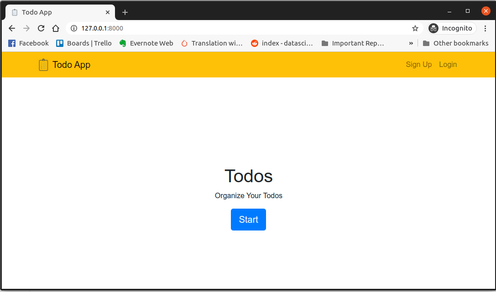
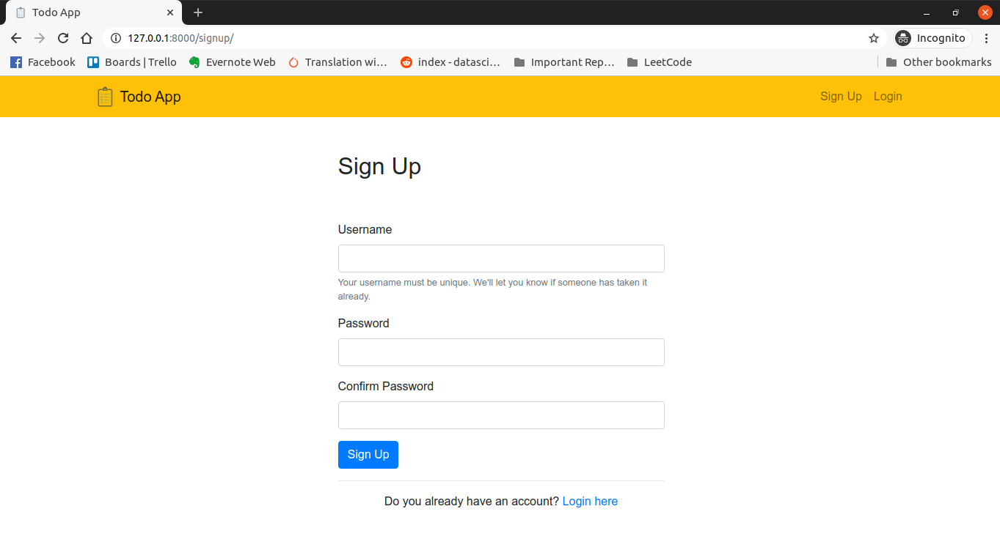
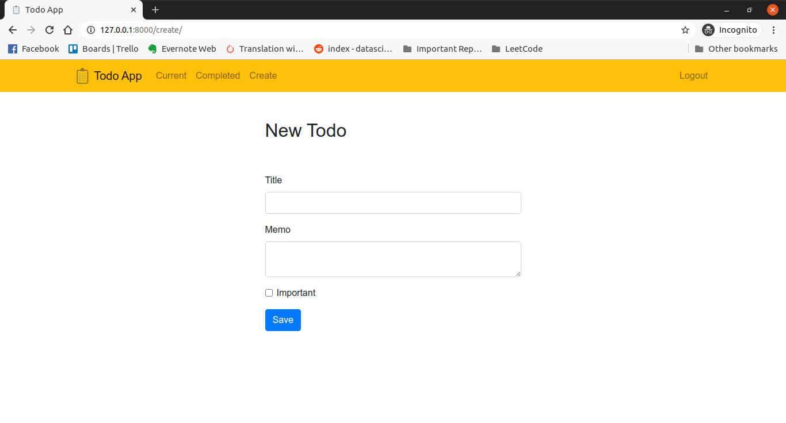
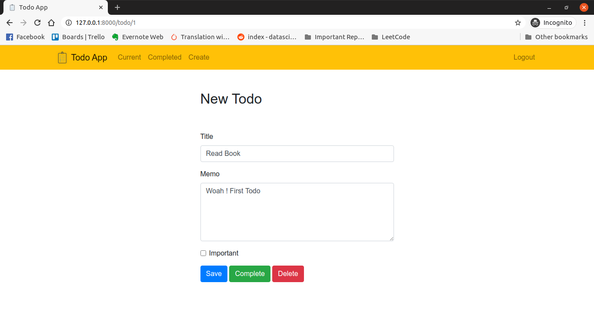
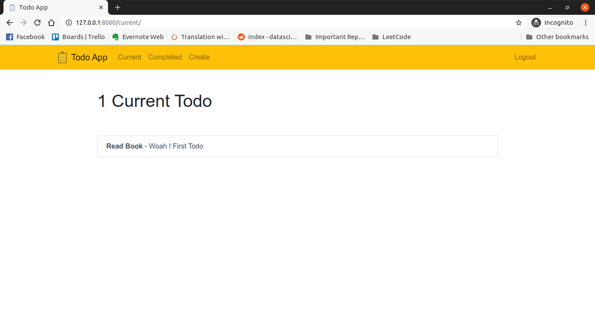

# Django TodoApp
A  Simple Todo App Built with


- Python 🐍
- Django 🎸
- Bootstrap 4 🌈
- Vanilla JS - ES6
- JQuery


**Clone the repo first**

```sh
git clone https://github.com/TheCaffeineDev/Django-TodoApp.git
```

**Move into it's folder by**

```sh
cd Django-TodoApp
```

**Make migrations**

```sh
python3 manage.py makemigrations
python3 manage.py migrate
```

**Run Server**

```sh
python3 manage.py runserver 
```

You need to create a superuser before using the admin

**Create Super User**

```
python3 manage.py createsuperuser
```

### Homepage



#### SignUp



#### Sign-In


#### Create Todo



#### Edit Todo



#### Current Todo

